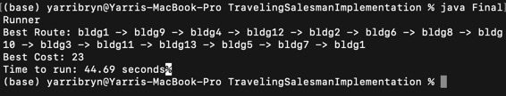

# TravelingSalesmanImplementation

TSP Implementation mostly from scratch, long hand (mostly), for a school project

Had some starter class names in the main file for automated test of the code, but nearly all of it is hacked out on my own. Well, including extreme googling and/or duck-duck-go-ing (hmm....?). I did implement Heap's Algorithm to increase runtime efficiency on my local computer, well before running it on cloud resources for formal evaluation.

#### How to use this yourself

There are a few steps needed to make this run on your computer. I have done this both on a mac (via terminal) and on windows (via cmd).

1. open up a terminal or command prompt
2. change directory to this project
3. compile using java 11 or later 
    - You need a version of java plus the JDK. For example, if you use vscode, you can use the extension by Microsoft titled *Java Extension Pack*. You can check if your machine has java (on MacOs) by running the following in the terminal

        java -version

    - additional info here: [vs code java info](https://code.visualstudio.com/docs/java/java-tutorial)
    - if you indeed do have java and a JDK installed, you'll see something like this:

&emsp;&emsp;&emsp;

    
4. run the file in the terminal using the following commands:

        java FinalRunner

    - no arguments are required (see instructions on the problem below)

5. the output2.txt file will have the optimal route for 13 buildings, and the shell should output the run time in seconds. *beware* - it might take a bit to run this....anywhere from 30s to 2+ minutes. the output should be something like the below:

&emsp;&emsp;

---

** below is the problem that was solved, summarized to obscure the problem as to not exactly give it away **

#### the problem

Use Java threads or Python threads. Your Runner class should be stored in a file called FinalRunner.java or FinalRunner.py. Your main method must be in the FinalRunner file.

This problem should optimize the time it takes to serve a route. There are obvious bad routes but the optimal route is not obvious. Your goal is to read in a file that gives the time in seconds to get from a building to every other building and determine the best possible route such that you start at the building listed on the first line, visit all other buildings and end at the building listed on the first line. The building names in the example below are arbitrary and can be called anything. The input file you will read in is called input2.txt and will be formatted in the following manner:

BldgOne : t(BldgOne) t(BldgTwo) t(BldgThree) t(BldgFour) t(BldgFive)

BldgTwo : t(BldgOne) t(BldgTwo) t(BldgThree) t(BldgFour) t(BldgFive)

BldgThree : t(BldgOne) t(BldgTwo) t(BldgThree) t(BldgFour) t(BldgFive)

BldgFour : t(BldgOne) t(BldgTwo) t(BldgThree) t(BldgFour) t(BldgFive)

BldgFive : t(BldgOne) t(BldgTwo) t(BldgThree) t(BldgFour) t(BldgFive)

Take the first line for example. t(BldgTwo) will be an integer value denoting the number of seconds it takes to get from BldgOne to BldgTwo. On the first line, t(BldgOne) will be 0. In other words, it takes 0 time to get from BldgOne to BldgOne. The input will always be formatted in this manner. If another building is constructed, it will be added to the end and the file will be updated accordingly. For example, if BldgSix were constructed, the time to BldgSix will be added at the end of every list and BldgSix will be added to the end of the file. The time from BldgOne to BldgThree may not be the same as the time from BldgThree to BldgOne. There may be one way streets; it may be uphill, etc. A sample input file is shown below:

abc : 0 5 7 3

def : 4 0 3 6

ghi : 6 4 0 4

jkl : 4 5 6 0

Each row in the sample input will start with the building ID, followed by a space, followed by a colon, followed by another space, then followed by a list of integer values to get to all of the other buildings where each value is separated by a space. 

Your goal is this, for the best route possible, print out the total time taken to start with the building on the first line, visit all buildings and then return to the building on the first line. You must also output the order in which you visited the buildings using the name of the buildings as defined in the input file. You must also output the total route cost. In the above example, there are only 6 possible routes. Each of them are shown below with their route cost and total cost at the end:

abc → def → ghi → jkl → abc : 5+3+4+4 = 16

abc → def → jkl → ghi → abc : 5+6+6+6 = 23

... et al

Your output file, which should be called output2.txt would contain the following answer:

abc def ghi jkl abc 16

A few constraints were required on the solution below:

- In order to get from BldgA to BldgC, the direct path will always be the best path. In other words, if going from BldgA to BldgC, then going directly from BldgA to BldgC will always be faster than to go from BldgA to any other arbitrary building (say BldgB) to BldgC.
- Your code must split up the computation in a reasonable fashion. Think about the solution space and how the potential solutions can be split up and checked in parallel.
- If you are solving this using Java, because this problem blows up in complexity, your code only needs to work for up to 13 buildings. 
- When using Java, if you are running out of memory, you should reconsider the way you are solving the problem. 
- This problem is not a heuristics problem. The goal of this problem is to guarantee that your code returns the correct answer. 
- Do not prompt the user or expect the user to enter in any arguments. The input file is input2.txt and the output file is output2.txt. Along the same lines, the number of buildings is an arbitrary size and should be determined by reading in the input file. Do not ask the user for this information. The input2.txt file should be in the same folder as your java files.

